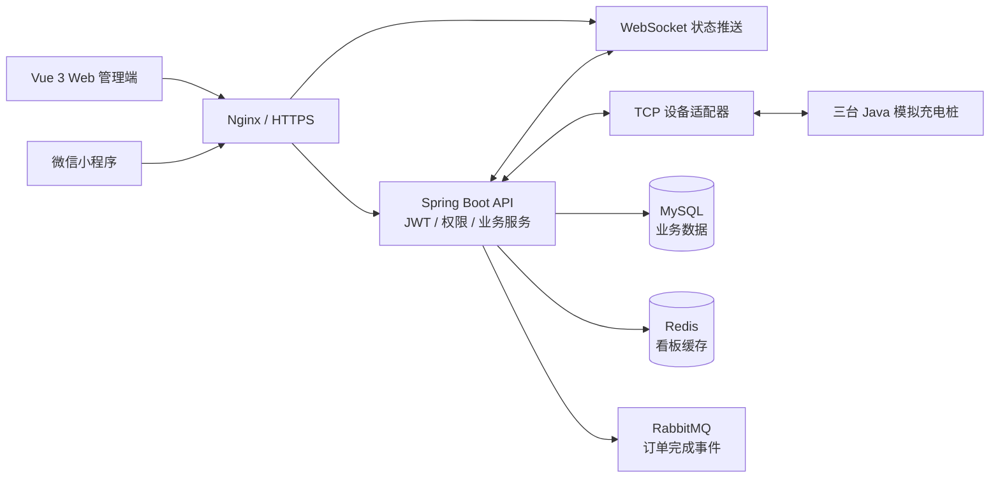
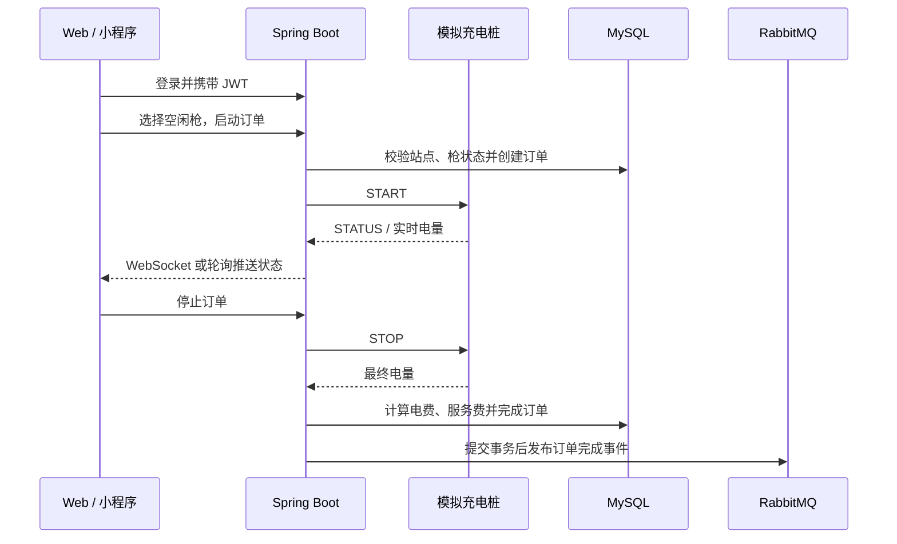
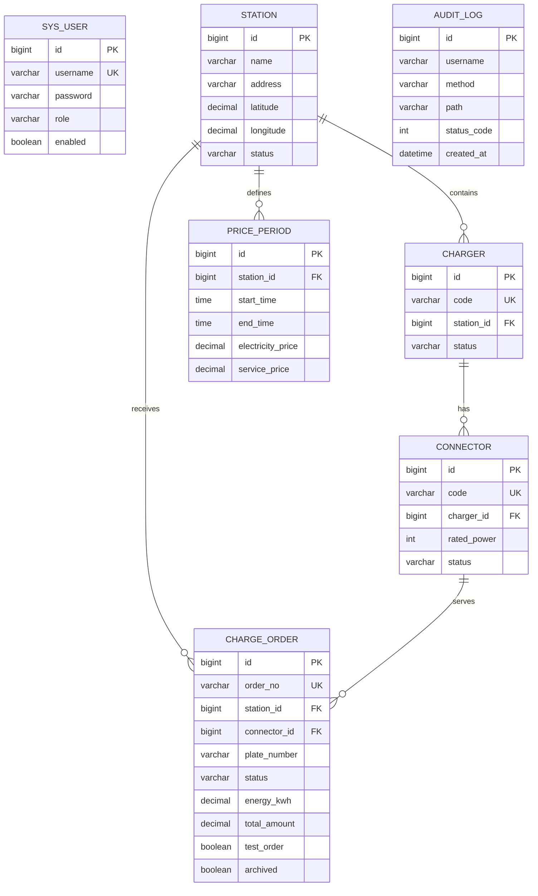

# 充电桩运营平台

一个可运行、可联调的充电运营平台作品，覆盖设备接入、实时状态、订单计费、消息可靠性和 Docker 部署。

> GitHub Pages：启用 Actions 后访问 `https://ifox-hu.github.io/charge-platform-learning/`

## GitHub Pages 在线演示

Pages 工作流会使用 `VITE_DEMO_MODE=true` 构建前端，访问者无需启动后端即可体验登录、站点与设备查看、模拟启动/结束充电、订单记录和 RabbitMQ 消息监控。演示数据保存在浏览器 `localStorage` 中，刷新后仍会保留；它不连接 MySQL、Redis、RabbitMQ，也不产生真实订单或支付。

演示登录使用任意用户名和密码 `123456`，例如 `demo_admin / 123456`。用户名包含 `admin` 时显示管理员菜单（包括消息监控），其他用户名显示运营员菜单。

本地验证演示模式：

```powershell
cd frontend
$env:VITE_DEMO_MODE = "true"
npm run dev
```

本地真实后端开发不设置该变量即可，前端会继续请求 `/api` 并连接真实 WebSocket。Pages 部署由 `.github/workflows/pages.yml` 在推送到 `main` 后自动完成。

如需在在线演示中显示真实高德地图，在仓库 `Settings -> Secrets and variables -> Actions -> Variables` 新增 `VITE_AMAP_KEY` 和 `VITE_AMAP_SECURITY_CODE`。高德控制台的 Web 端 Key 要把 `ifox-hu.github.io` 加入安全域名白名单。未配置或加载失败时会自动显示虚拟演示地图。

本地 Web 地图白名单不要填写完整 URL。高德控制台的“域名白名单”分别填写 `localhost`、`127.0.0.1`；如果用局域网 IP 访问，再填写电脑局域网 IP，例如 `192.168.1.4`。不要填写 `http://localhost:5174/`、端口、路径或末尾斜杠。GitHub Pages 仍填写 `ifox-hu.github.io`，小程序地图使用微信开发者工具的合法域名校验配置，与 Web Key 白名单分开。
> 在线 API：需要在 GitHub 仓库 Variables 中配置 `VITE_API_BASE_URL`，例如 `https://api.example.com/api`
> 演示账号：`demo_admin / 123456`（管理员）、`demo_operator / 123456`（运营员）
> 本账号仅用于演示环境，请勿用于生产。

## 演示体验

1. 登录 Web 管理端，进入“运营看板”观察三台模拟桩和充电枪状态。
2. 在“设备管理”或订单区域选择空闲枪，启动一次模拟充电。
3. 观察 WebSocket 推送的功率、电压、电流和累计电量。
4. 停止订单，查看分时电价结算、订单状态和操作审计。
5. 使用管理员账号打开“消息监控”，查看 RabbitMQ 队列和死信处理能力。

## 项目亮点

- Java TCP 模拟桩还原设备接入，三台设备可同时在线联调。
- Spring Boot 事务、行锁和提交后事件保证订单结算一致性。
- WebSocket 推送设备状态，Redis 缓存运营看板，RabbitMQ 处理订单完成事件。
- JWT + ADMIN/OPERATOR 权限、操作审计、订单导出和测试订单清理。
- Docker Compose 一键初始化，GitHub Actions 自动测试、构建和 SSH 部署。

## 技术栈

`Java 17` `Spring Boot` `MyBatis-Plus` `Vue 3` `MySQL` `Redis` `RabbitMQ` `WebSocket` `Docker Compose`

下面是完整的开发、部署和故障排查手册。

这是项目的统一开发文档，覆盖环境准备、架构、本地开发、模拟桩、接口、数据库、Docker 部署和故障排查。

## 目录

1. [项目概览](#1-项目概览)
2. [环境准备与首次启动](#2-环境准备与首次启动)
3. [项目结构与架构](#3-项目结构与架构)
4. [本地开发](#4-本地开发)
5. [模拟桩联调](#5-模拟桩联调)
6. [接口和实时通信](#6-接口和实时通信)
7. [数据库](#7-数据库)
8. [Docker 部署](#8-docker-部署)
9. [故障排查](#9-故障排查)
10. [验证清单](#10-验证清单)
11. [一键初始化、自动部署与消息监控](#11-一键初始化自动部署与消息监控)

面试演示脚本：[`docs/interview-demo.md`](docs/interview-demo.md)

## 1. 项目概览

项目由 Java 17、Spring Boot 3.5、MyBatis-Plus、Vue 3、MySQL、Redis、RabbitMQ、微信小程序和 TCP 模拟桩组成。

主要功能：

- 站点、充电桩、充电枪、分时电价和订单管理。
- ADMIN/OPERATOR 权限、普通用户账号管理、操作审计、订单导出。
- Redis 看板缓存，RabbitMQ 订单完成事件和死信队列。
- WebSocket 设备状态推送，断线后轮询兜底。
- Web 与小程序地图定位、地址解析和模拟充电。

完整链路：客户端选择空闲枪 -> 后端校验并锁定 -> 发送 START -> 模拟桩上报电量 -> 发送 STOP -> 分时电价结算 -> 事务提交后发布订单完成事件。

仓库：https://github.com/ifox-hu/charge-platform-learning

### 1.1 项目背景

传统充电桩系统通常同时涉及运营管理、设备通信、订单计费和多端展示，单独调试其中一个环节很困难。本项目以“可运行、可联调、可扩展”为目标，把真实平台中最核心的链路压缩成一个学习型项目：Web 管理端和微信小程序负责操作，Spring Boot 负责业务和权限，模拟桩负责还原设备通信，MySQL 保存业务数据，Redis 和 RabbitMQ 分别承担缓存与异步事件。

项目适合用于学习以下内容：

- 如何从站点、充电桩、充电枪建模，并完成订单状态流转。
- 如何用 TCP 接入设备，用 WebSocket 向前端推送实时状态。
- 如何使用事务、行锁和分时电价保证充电结算的一致性。
- 如何把缓存、消息队列、审计、Docker 部署整合到一个完整业务中。

### 1.2 项目目标

项目不模拟真实厂商协议的全部细节，而是提供一条容易观察和修改的端到端链路。开发者可以先用模拟桩完成启动、实时充电和停止结算，再逐步替换为真实设备适配器；数据库迁移、权限边界、消息失败重试和部署流程也都保留了清晰的扩展位置。

## 2. 环境准备与首次启动

### 2.1 软件

| 工具 | 用途 | 检查 |
|---|---|---|
| JDK 17 | 后端、模拟桩 | java -version |
| Maven 3.9+ | 构建测试 | mvn -version |
| Node.js/npm | Web 构建 | node -v、npm -v |
| Docker Compose | 容器运行 | docker compose version |
| 微信开发者工具 | 小程序调试 | 选择 miniapp/ |

### 2.2 获取代码

~~~bash
git clone https://github.com/ifox-hu/charge-platform-learning.git
cd charge-platform-learning
~~~

复制 .env.example 为 .env，填写数据库、RabbitMQ 和 JWT_SECRET。密码、证书、备份和日志不要上传 GitHub。

### 2.3 新数据库

空库按 V1 到 V5 顺序执行：

| 版本 | 文件 | 内容 |
|---|---|---|
| V1 | docs/db/V1__baseline_schema.sql | 六张基础表 |
| V2 | docs/db/V2__station_coordinates.sql | 站点 GCJ-02 坐标 |
| V3 | docs/db/V3__order_test_and_archive.sql | 测试订单、归档字段 |
| V4 | docs/db/V4__audit_log.sql | 审计表 |
| V5 | docs/db/V5__customer_mock_payment.sql | 普通用户订单归属和模拟支付 |

Docker MySQL 只在全新空数据卷第一次启动时自动执行 docs/db。演示账号和演示设备不会自动创建，本地需要时手动导入：

~~~bash
docker compose -f docker-compose.yml exec -T mysql sh -c 'MYSQL_PWD="$MYSQL_ROOT_PASSWORD" mysql -uroot "$MYSQL_DATABASE"' < docs/demo_seed.sql
~~~

demo_admin、demo_operator 的演示密码是 123456，只用于本地隔离环境。

已有数据库不要执行 V1 或 demo_seed.sql。先备份，再检查并只执行缺少的 V2、V3、V4、V5：

~~~sql
SHOW TABLES;
SHOW COLUMNS FROM station LIKE 'latitude';
SHOW COLUMNS FROM charge_order LIKE 'test_order';
SHOW TABLES LIKE 'audit_log';
~~~

### 2.4 首次启动

~~~bash
docker compose -f docker-compose.yml config --quiet
docker compose -f docker-compose.yml up -d --build
docker compose -f docker-compose.yml ps
~~~

访问 http://localhost:5173；后端健康检查为 http://localhost:8081/api/health。局域网 IP 的浏览器定位需要 HTTPS。

## 3. 项目结构与架构

### 3.1 总体架构图



### 3.2 一次充电业务流程



~~~text
backend/       Spring Boot 后端、权限、订单、TCP 适配器
frontend/      Vue 3 + Vite Web 管理端
miniapp/       微信小程序
simulator/     Java TCP 模拟充电桩
docs/          统一手册、迁移脚本和部署资料
~~~

请求链路：

~~~text
客户端 -> JWT 过滤器 -> Controller -> Service -> Mapper -> MySQL
                                      |             |
                                      +-> Redis     +-> 提交后 RabbitMQ
~~~

JWT 过滤器解析令牌，SecurityConfig 负责 ADMIN/OPERATOR 权限。订单停止使用事务和行锁，提交后才发送 OrderCompletedEvent。Redis 缓存默认 30 秒，故障时回源 MySQL。模拟桩只通过 TCP 连接后端。

## 4. 本地开发

### 4.1 IDEA 环境变量

~~~text
DB_HOST=127.0.0.1
DB_PORT=3306
DB_NAME=charge_platform
DB_USERNAME=本地数据库用户
DB_PASSWORD=本地数据库密码
JWT_SECRET=至少32字符的随机字符串
REDIS_HOST=127.0.0.1
RABBITMQ_HOST=127.0.0.1
SIMULATOR_ENABLED=true
SIMULATOR_SYNC_DATABASE=true
SIMULATOR_DEVICES=SIM-PILE-001@127.0.0.1:9100,SIM-PILE-002@127.0.0.1:9101,SIM-PILE-003@127.0.0.1:9102
~~~

不要把真实密码写进 application.yml。PowerShell 临时变量格式是 $env:变量名 = '值'。

### 4.2 后端

~~~powershell
cd E:\充电桩\charge-platform-learning\backend
mvn test
mvn spring-boot:run
~~~

使用仓库内缓存：mvn "-Dmaven.repo.local=.m2-repo" test。后端端口为 8081。

### 4.3 Web

~~~powershell
cd E:\充电桩\charge-platform-learning\frontend
npm ci
npm run dev -- --host 0.0.0.0
~~~

访问 http://localhost:5174。Vite 把 /api 和 /ws 代理到 8081；发布执行 npm run build。

Web 端登录 ADMIN 或 OPERATOR 后可打开“用户账号”：按用户名、昵称和角色筛选普通用户/运营员/管理员。ADMIN 可以启用或禁用普通用户、重置密码；OPERATOR 只读查看。管理员账号在页面中受保护，普通用户只允许通过微信小程序访问自己的订单。

### 4.4 小程序

微信开发者工具选择 miniapp/，修改 miniapp/config/env.js 的 baseUrl。手机中的 localhost 指手机本身；正式真机需要 HTTPS 合法域名。地图坐标使用 gcj02。小程序约每 5 秒刷新枪状态，Web 增加数据库枪后，模拟器物理枪数仍需手动调整。

## 5. 模拟桩联调

| 设备 | 端口 | 默认枪数 |
|---|---:|---:|
| SIM-PILE-001 | 9100 | 2 |
| SIM-PILE-002 | 9101 | 2 |
| SIM-PILE-003 | 9102 | 4 |

模拟器使用逐行 JSON TCP 协议，支持 HELLO、STATUS、START、STOP、PING。time-scale=1 是真实速度。

~~~powershell
cd E:\充电桩\charge-platform-learning\simulator
mvn package
java -Dsimulator.port=9100 -Dsimulator.device-id=SIM-PILE-001 -Dsimulator.connectors=2 -Dsimulator.time-scale=1 -jar target\charge-platform-simulator-0.1.0-SNAPSHOT.jar
java -Dsimulator.port=9101 -Dsimulator.device-id=SIM-PILE-002 -Dsimulator.connectors=2 -Dsimulator.time-scale=1 -jar target\charge-platform-simulator-0.1.0-SNAPSHOT.jar
java -Dsimulator.port=9102 -Dsimulator.device-id=SIM-PILE-003 -Dsimulator.connectors=4 -Dsimulator.time-scale=1 -jar target\charge-platform-simulator-0.1.0-SNAPSHOT.jar
Get-NetTCPConnection -LocalPort 9100,9101,9102 -State Listen
~~~

联调步骤：确认三个端口监听；启动后端并检查 GET /api/simulator/status；确认设备和枪编码映射；启动订单；查询 GET /api/orders/{id}/live；停止订单并核对 COMPLETED 和最终金额。

Web 新增第 5 把枪只改了数据库，不能自动增加模拟器物理枪。必须增加 simulator.connectors 并重启对应模拟桩。

## 6. 接口和实时通信

基础地址为 http://localhost:8081/api。除登录和健康检查外都需要 Authorization: Bearer token。

~~~http
POST /api/auth/login
Content-Type: application/json

{"username":"已有账号","password":"账号密码"}
~~~

常用接口：

| 模块 | 接口 |
|---|---|
| 站点 | GET/POST/PUT/DELETE /stations |
| 桩 | GET/POST/PUT/DELETE /chargers |
| 枪 | GET/POST/PUT/DELETE /connectors |
| 电价 | GET/POST/PUT/DELETE /price-periods |
| 订单 | GET /orders、POST /orders/start、POST /orders/{id}/stop |
| 审计 | GET /audit-logs、DELETE /audit-logs/before?days=7 |

启动订单字段包含 stationId、connectorId、plateNumber、testOrder。车牌是地区简称、大写字母和 5 或 6 位数字。模拟桩启用时停止请求体可以为空，后端读取最终电量。

WebSocket 为 ws://localhost:8081/ws/status，HTTPS 页面使用 wss://。Nginx 必须转发 Upgrade 和 Connection。RabbitMQ 使用 charge.order.exchange、charge.order.completed 和 charge.order.completed.dlq；队列为 0 可能代表消息已被即时消费。

## 7. 数据库

### 7.1 设计说明

数据库围绕“站点 -> 充电桩 -> 充电枪 -> 充电订单”建立核心业务链路，分时电价挂在站点上，用户负责登录和权限，审计表记录管理操作。V2～V4 是在基础表上的增量演进：坐标用于 Web/小程序地图，订单归档字段用于清理测试订单，审计表用于追踪管理行为。

### 7.2 核心表关系图



### 7.3 表用途

| 表 | 用途 |
|---|---|
| `sys_user` | 登录账号、角色和启用状态 |
| `station` | 充电站基本信息、地址、状态和 GCJ-02 坐标 |
| `charger` | 站内充电桩设备及在线状态 |
| `connector` | 充电枪、额定功率和空闲/充电状态 |
| `price_period` | 站点分时电价和服务费 |
| `charge_order` | 车牌、充电时间、电量、费用、测试标记和归档状态 |
| `audit_log` | 管理员/运营员操作、请求路径、状态码和时间 |

### 7.4 数据库脚本顺序

V1 建立 sys_user、station、charger、connector、price_period、charge_order；V2 增加坐标；V3 增加 test_order、archived、archived_at；V4 建立 audit_log；V5 增加普通用户订单归属和模拟支付字段。

手动建库：

~~~sql
CREATE DATABASE charge_platform CHARACTER SET utf8mb4 COLLATE utf8mb4_0900_ai_ci;
~~~

~~~bash
mysql -h 127.0.0.1 -uroot -p charge_platform < docs/db/V1__baseline_schema.sql
mysql -h 127.0.0.1 -uroot -p charge_platform < docs/db/V2__station_coordinates.sql
mysql -h 127.0.0.1 -uroot -p charge_platform < docs/db/V3__order_test_and_archive.sql
mysql -h 127.0.0.1 -uroot -p charge_platform < docs/db/V4__audit_log.sql
~~~

备份与恢复：

~~~bash
mysqldump -h 127.0.0.1 -uroot -p --single-transaction --routines --events --triggers charge_platform > charge_platform_backup.sql
test -s charge_platform_backup.sql && echo '备份文件非空'
mysql -h 127.0.0.1 -uroot -p charge_platform < charge_platform_backup.sql
~~~

恢复会替换目标库，执行前再次备份。不要上传备份、.env 或密码。

## 8. Docker 部署

在线版使用 docker-compose.yml；离线服务器使用 docker-compose.server.yml。离线版入口为 HTTPS 服务器 IP。

本地构建：

~~~powershell
cd E:\充电桩\charge-platform-learning\backend; mvn package
cd ..\simulator; mvn package
cd ..\frontend; npm ci; npm run build
~~~

上传服务器：Compose 文件、服务器 .env、两个 JAR、frontend/dist、frontend/nginx.conf 和需要的 docs/db。服务器需已有 centos7-jdk17、nginx、mysql、redis、rabbitmq 镜像。

启动核验：

~~~bash
docker compose -f docker-compose.server.yml config --quiet
docker compose -f docker-compose.server.yml up -d
docker compose -f docker-compose.server.yml ps
docker port charge-platform-learning-frontend-1
~~~

离线版 Nginx 监听 443，需要 certs/server.crt 和 certs/server.key。证书缺失时前端容器会反复重启。更新时先备份，再上传新 JAR/dist，最后执行：

~~~bash
docker compose -f docker-compose.server.yml up -d --force-recreate backend frontend simulator-001 simulator-002 simulator-003
~~~

不要使用 docker compose down -v，以免删除数据卷。

## 9. 故障排查

先看状态和日志：

~~~bash
docker compose -f docker-compose.server.yml ps
docker compose -f docker-compose.server.yml logs --tail 80 backend frontend rabbitmq
~~~

- 页面无数据：检查六张基础表、audit_log、V2 到 V5；全新库还需手动导入 demo_seed.sql。
- RabbitMQ unhealthy：等待旧卷恢复，查看日志和 State.Health.Status，不要删除数据卷。
- HTTPS 拒绝连接：检查 443 映射、容器状态、证书路径和 Nginx 日志。
- 浏览器不弹定位：局域网 HTTP IP 不是安全来源，使用 HTTPS 或 localhost。
- 小程序加载失败：检查 env.js 的 baseUrl、8081 可达性、合法域名和 gcj02。
- Web 加枪后数量不一致：重新进入详情；数据库枪数和模拟器物理枪数需要分别配置。
- WebSocket 不推送：检查 /ws/status 握手、wss 和 Nginx Upgrade 转发。
- 代码修改不生效：重新打包 JAR、重新构建 dist、上传并重建对应容器。

## 10. 验证清单

| 改动 | 最低验证 |
|---|---|
| 后端 | mvn test、健康接口、相关业务接口 |
| Web | npm run build、登录和关键交互 |
| 小程序 | 开发者工具编译、页面切换、定位 |
| 模拟桩 | mvn test、三个 TCP 连接、START/STOP |
| 数据库 | 备份、按 V1 到 V5 执行、检查字段索引 |
| Docker | config --quiet、ps、日志、HTTPS、完整充电链路 |

## 11. 一键初始化、自动部署与消息监控

### 11.1 Docker Compose 一键初始化

PowerShell 执行 `.\scripts\init-compose.ps1`，Linux/macOS 执行 `bash scripts/init-compose.sh`。脚本会在缺少 `.env` 时复制 `.env.example`，校验 Compose 配置，构建并启动全部服务，然后显示容器状态。仅在全新本地数据卷需要演示数据时追加 `--Seed`（PowerShell）或 `--seed`（Linux）；已有数据库不要重复导入 `docs/demo_seed.sql`。

### 11.2 CI/CD

`.github/workflows/ci.yml` 在 push 和 Pull Request 上运行后端 `mvn test`、前端 `npm ci && npm run build` 以及 Compose 配置校验。`.github/workflows/deploy.yml` 在手工触发或推送 `v*` 标签时构建两个 JAR 和前端静态文件，并通过 SSH/rsync 上传服务器，调用 `scripts/deploy-server.sh` 重建应用容器。

生产仓库需要配置 GitHub Environment `production` 的 `DEPLOY_HOST`、`DEPLOY_USER`、`DEPLOY_PATH` 和 `DEPLOY_SSH_KEY` secrets。服务器提前准备 `.env`、证书、`docker-compose.server.yml` 依赖的基础镜像和数据卷；部署脚本不会删除数据卷。

### 11.3 RabbitMQ 监控与死信处理

管理员登录 Web 后打开“消息监控”，可以查看订单完成队列的待处理数量、消费者数量、死信数量和死信消费者数量。点击“重试死信”会把最多 100 条消息重新发送到订单交换机，点击“清空死信队列”会永久删除当前死信，操作前应先查看 RabbitMQ 管理台 `http://localhost:15672` 并确认消息内容。对应 API 为 `GET /api/rabbitmq/overview`、`POST /api/rabbitmq/dead-letters/retry?limit=100` 和 `DELETE /api/rabbitmq/dead-letters`，均要求 ADMIN 角色。
