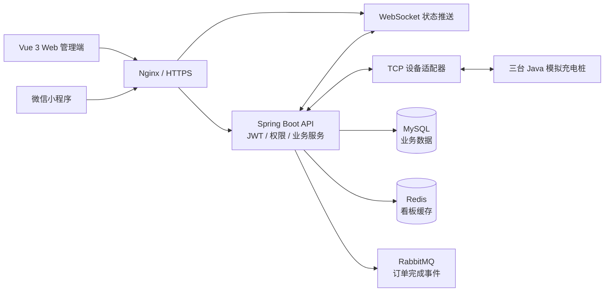
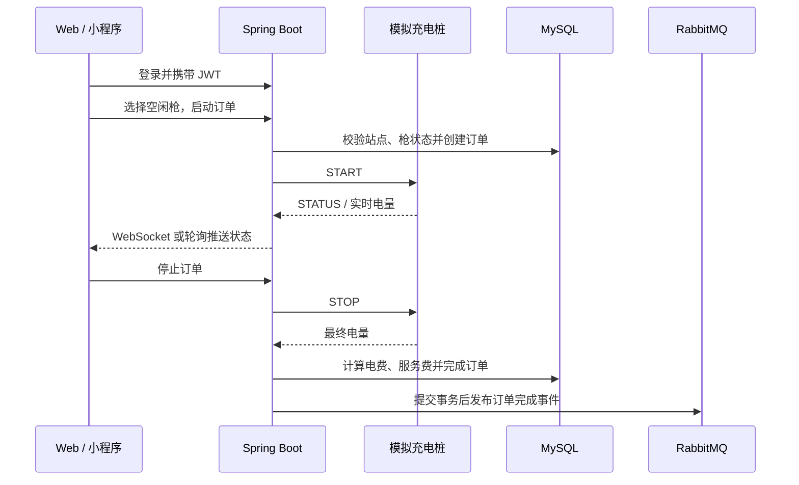
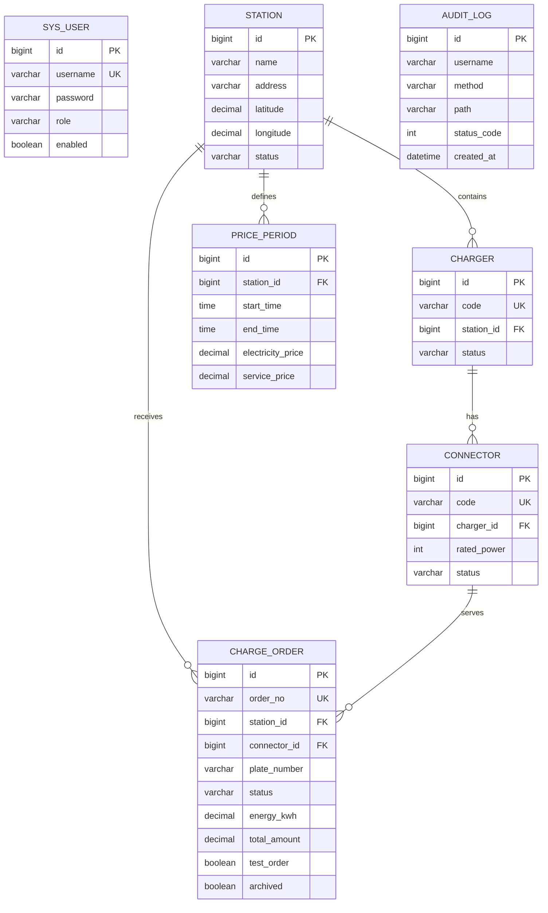

# 充电桩运营平台

一个可运行、可联调的充电运营平台作品，覆盖设备接入、实时状态、订单计费、消息可靠性和 Docker 部署。

> GitHub Pages：启用 Actions 后访问 `https://ifox-hu.github.io/charge-platform-learning/`

## GitHub Pages 在线演示

Pages 工作流会使用 `VITE_DEMO_MODE=true` 构建前端，访问者无需启动后端即可体验登录、站点与设备查看、模拟启动/结束充电、订单记录和 RabbitMQ 消息监控。演示数据保存在浏览器 `localStorage` 中，刷新后仍会保留；它不连接 MySQL、Redis、RabbitMQ，也不产生真实订单或支付。

演示登录使用任意用户名和密码 `123456`，例如 `demo_admin / 123456`。用户名包含 `admin` 时显示管理员菜单（包括消息监控），其他用户名显示运营员菜单。

本地验证演示模式：

```powershell
cd frontend
$env:VITE_DEMO_MODE = "true"
npm run dev
```

本地真实后端开发不设置该变量即可，前端会继续请求 `/api` 并连接真实 WebSocket。Pages 部署由 `.github/workflows/pages.yml` 在推送到 `main` 后自动完成。


## 当前推荐运行方式

完整本地联调使用下面的组合：虚拟机 Docker 运行 MySQL、Redis、RabbitMQ 和三台模拟桩；Windows IDEA 运行后端；Windows 终端运行前端；微信开发者工具运行小程序。首次启动和日常启动都按“环境准备与首次启动”执行。

不想安装本地依赖时，直接打开 [GitHub Pages 快速演示](https://ifox-hu.github.io/charge-platform-learning/)。它使用浏览器演示数据，不连接本地后端、数据库、Redis、RabbitMQ 或模拟桩。

## 演示体验

1. 登录 Web 管理端，进入“运营看板”观察三台模拟桩和充电枪状态。
2. 在“设备管理”或订单区域选择空闲枪，启动一次模拟充电。
3. 观察 WebSocket 推送的功率、电压、电流和累计电量。
4. 停止订单，查看分时电价结算、订单状态和操作审计。
5. 使用管理员账号打开“消息监控”，查看 RabbitMQ 队列和死信处理能力。

## 项目亮点

- Java TCP 模拟桩还原设备接入，三台设备可同时在线联调。
- Spring Boot 事务、行锁和提交后事件保证订单结算一致性。
- WebSocket 推送设备状态，Redis 缓存运营看板，RabbitMQ 处理订单完成事件。
- JWT + ADMIN/OPERATOR 权限、操作审计、订单导出和测试订单清理。
- Docker Compose 可选部署，GitHub Actions 自动测试、构建和 SSH 部署。

## 技术栈

`Java 17` `Spring Boot` `MyBatis-Plus` `Vue 3` `MySQL` `Redis` `RabbitMQ` `WebSocket` `Docker Compose`

下面是完整的开发、部署和故障排查手册。

这是项目的统一开发文档，覆盖环境准备、架构、本地开发、模拟桩、接口、数据库、Docker 部署和故障排查。

## 目录

1. [项目概览](#1-项目概览)
2. [环境准备与首次启动](#2-环境准备与首次启动)
3. [项目结构与架构](#3-项目结构与架构)
4. [本地开发](#4-本地开发)
5. [模拟桩联调](#5-模拟桩联调)
6. [接口和实时通信](#6-接口和实时通信)
7. [数据库](#7-数据库)
8. [Docker 部署](#8-docker-部署)
9. [故障排查](#9-故障排查)
10. [验证清单](#10-验证清单)
11. [自动部署与消息监控](#11-自动部署与消息监控)

## 1. 项目概览

项目由 Java 17、Spring Boot 3.5、MyBatis-Plus、Vue 3、MySQL、Redis、RabbitMQ、微信小程序和 TCP 模拟桩组成。

主要功能：

- 站点、充电桩、充电枪、分时电价和订单管理。
- ADMIN/OPERATOR 权限、普通用户账号管理、操作审计、订单导出。
- Redis 看板缓存，RabbitMQ 订单完成事件和死信队列。
- WebSocket 设备状态推送，断线后轮询兜底。
- Web 与小程序地图定位、地址解析和模拟充电。

完整链路：客户端选择空闲枪 -> 后端校验并锁定 -> 发送 START -> 模拟桩上报电量 -> 发送 STOP -> 分时电价结算 -> 事务提交后发布订单完成事件。

仓库：https://github.com/ifox-hu/charge-platform-learning

### 1.1 项目背景

传统充电桩系统通常同时涉及运营管理、设备通信、订单计费和多端展示，单独调试其中一个环节很困难。本项目以“可运行、可联调、可扩展”为目标，把真实平台中最核心的链路压缩成一个学习型项目：Web 管理端和微信小程序负责操作，Spring Boot 负责业务和权限，模拟桩负责还原设备通信，MySQL 保存业务数据，Redis 和 RabbitMQ 分别承担缓存与异步事件。

项目适合用于学习以下内容：

- 如何从站点、充电桩、充电枪建模，并完成订单状态流转。
- 如何用 TCP 接入设备，用 WebSocket 向前端推送实时状态。
- 如何使用事务、行锁和分时电价保证充电结算的一致性。
- 如何把缓存、消息队列、审计、Docker 部署整合到一个完整业务中。

### 1.2 项目目标

项目不模拟真实厂商协议的全部细节，而是提供一条容易观察和修改的端到端链路。开发者可以先用模拟桩完成启动、实时充电和停止结算，再逐步替换为真实设备适配器；数据库迁移、权限边界、消息失败重试和部署流程也都保留了清晰的扩展位置。

## 2. 环境准备与首次启动

### 2.1 软件

| 工具 | 用途 | 检查 |
|---|---|---|
| JDK 17 | 后端、模拟桩 | java -version |
| Maven 3.9+ | 构建测试 | mvn -version |
| Node.js 20 LTS / npm 10+ | Web 构建 | `node -v`、`npm -v` |
| Docker Engine / Compose v2 | 容器运行 | `docker --version`、`docker compose version` |
| 微信开发者工具 | 小程序调试 | 选择 miniapp/ |

### 2.2 准备 Windows 项目

```powershell
git clone https://github.com/ifox-hu/charge-platform-learning.git
cd E:\充电桩\charge-platform-learning
```

Windows 需要安装 JDK 17、Maven 3.9+、Node.js 20 LTS 和 npm 10+。虚拟机需要 Docker Engine、Docker Compose v2，以及 `centos7-jdk17:latest` 镜像。

Docker Engine 安装：

```bash
curl -fsSL https://get.docker.com | bash
systemctl enable --now docker
```

Docker Compose v2 安装（Docker 新版本通常已自带；缺少时执行）：

```bash
mkdir -p /usr/local/lib/docker/cli-plugins
curl -SL https://github.com/docker/compose/releases/latest/download/docker-compose-linux-x86_64 \
  -o /usr/local/lib/docker/cli-plugins/docker-compose
chmod +x /usr/local/lib/docker/cli-plugins/docker-compose
docker compose version
```

`centos7-jdk17:latest` 是 `docker-compose.server.yml` 中三个模拟桩容器和服务器后端容器使用的 Java 运行时镜像。

`centos7-jdk17:latest` 下载和验证：

```bash
docker pull centos7-jdk17:latest
docker image inspect centos7-jdk17:latest >/dev/null && echo '镜像已存在'
docker run --rm centos7-jdk17:latest java -version
```

如果镜像仓库无法直接拉取，可以从已有该镜像的 Docker 主机导出后导入：

```bash
# 有镜像的 Docker 主机
docker save centos7-jdk17:latest -o centos7-jdk17.tar
# 虚拟机
docker load -i centos7-jdk17.tar
```

### 2.3 第一次编译并上传模拟桩

模拟桩容器只需要一个 JAR。Windows 编译：

```powershell
cd E:\充电桩\charge-platform-learning\simulator
mvn package
```

通过你当前使用的虚拟机文件拖拽功能，把下面这些内容放到虚拟机同一个项目目录，例如 `/root/charge-platform-learning/`：

```text
docker-compose.server.yml
.env
docs/db/
docs/demo_seed.sql
simulator/target/charge-platform-simulator-0.1.0-SNAPSHOT.jar
```

虚拟机目录结构必须是：

```text
/root/charge-platform-learning/
├── .env
├── docker-compose.server.yml
├── docs/
│   ├── db/
│   └── demo_seed.sql
└── simulator/target/charge-platform-simulator-0.1.0-SNAPSHOT.jar
```

`.env` 至少填写：

```dotenv
MYSQL_ROOT_PASSWORD=修改为数据库 root 密码
MYSQL_DATABASE=charge_platform
MYSQL_USER=charge
MYSQL_PASSWORD=修改为业务数据库密码
RABBITMQ_USERNAME=guest
RABBITMQ_PASSWORD=guest
JWT_SECRET=至少32位随机字符串
SIMULATOR_TIME_SCALE=1
```

密码、密钥和备份文件不要提交到 GitHub。

### 2.4 首次创建虚拟机 Docker 的 6 个容器

在虚拟机中执行。这里明确只启动基础设施和模拟桩，不启动 Compose 里的后端和前端：

```bash
cd /root/charge-platform-learning
docker compose -f docker-compose.server.yml config --quiet
docker compose -f docker-compose.server.yml up -d \
  mysql redis rabbitmq simulator-001 simulator-002 simulator-003
docker compose -f docker-compose.server.yml ps
```

端口映射为：

```text
3306  MySQL
6379  Redis
5672  RabbitMQ
9100  SIM-PILE-001
9101  SIM-PILE-002
9102  SIM-PILE-003
```

MySQL 的全新数据卷第一次启动时会自动执行 `docs/db/V1__...` 到 `V5__...`。容器健康后，导入演示账号、演示站点和演示设备：

```bash
until docker compose -f docker-compose.server.yml exec -T mysql \
  sh -c 'mysqladmin ping -h localhost -uroot -p"$MYSQL_ROOT_PASSWORD" --silent' \
  >/dev/null 2>&1; do sleep 2; done

docker compose -f docker-compose.server.yml exec -T mysql \
  sh -c 'MYSQL_PWD="$MYSQL_ROOT_PASSWORD" mysql -uroot "$MYSQL_DATABASE"' \
  < docs/demo_seed.sql
```

演示账号：`demo_admin / 123456`、`demo_operator / 123456`。

如果数据库卷已经存在，不要重复执行 V1 或重复导入种子；先执行 `docker compose ... ps` 和数据库检查。

### 2.5 IDEA 启动后端

虚拟机 IP 以实际环境为准。本文示例使用 `192.168.6.100`。在 IDEA 的 Spring Boot Run Configuration 中设置：

```text
DB_HOST=192.168.6.100
DB_PORT=3306
DB_NAME=charge_platform
DB_USERNAME=charge
DB_PASSWORD=与虚拟机 .env 相同
REDIS_HOST=192.168.6.100
REDIS_PORT=6379
RABBITMQ_HOST=192.168.6.100
RABBITMQ_PORT=5672
RABBITMQ_USERNAME=guest
RABBITMQ_PASSWORD=与虚拟机 .env 相同
JWT_SECRET=与虚拟机 .env 相同
SIMULATOR_ENABLED=true
SIMULATOR_SYNC_DATABASE=true
SIMULATOR_DEVICES=SIM-PILE-001@192.168.6.100:9100,SIM-PILE-002@192.168.6.100:9101,SIM-PILE-003@192.168.6.100:9102
```

启动后端，端口为 `8081`，验证：`http://localhost:8081/api/health`。

不使用 IDEA 时，也可以在 Windows PowerShell 中启动后端。先在同一个终端设置环境变量，再执行：

```powershell
$env:DB_HOST = '192.168.6.100'
$env:DB_PORT = '3306'
$env:DB_NAME = 'charge_platform'
$env:DB_USERNAME = 'charge'
$env:DB_PASSWORD = '与虚拟机 .env 相同'
$env:REDIS_HOST = '192.168.6.100'
$env:REDIS_PORT = '6379'
$env:RABBITMQ_HOST = '192.168.6.100'
$env:RABBITMQ_PORT = '5672'
$env:RABBITMQ_USERNAME = 'guest'
$env:RABBITMQ_PASSWORD = '与虚拟机 .env 相同'
$env:JWT_SECRET = '与虚拟机 .env 相同'
$env:SIMULATOR_ENABLED = 'true'
$env:SIMULATOR_SYNC_DATABASE = 'true'
$env:SIMULATOR_DEVICES = 'SIM-PILE-001@192.168.6.100:9100,SIM-PILE-002@192.168.6.100:9101,SIM-PILE-003@192.168.6.100:9102'

cd E:\充电桩\charge-platform-learning\backend
mvn spring-boot:run
```

IDEA 和终端二选一，不要同时启动两个后端实例。

### 2.6 启动 Web 和微信小程序

Windows 终端启动 Web：

```powershell
cd E:\充电桩\charge-platform-learning\frontend
npm ci
npm run dev -- --host 0.0.0.0
```

访问 `http://localhost:5174`。Vite 会把 `/api` 和 `/ws` 代理到 IDEA 的 `8081`。

微信开发者工具导入 `E:\充电桩\charge-platform-learning\miniapp`。开发环境 `miniapp/config/env.js` 保持：

```javascript
baseUrl: 'http://127.0.0.1:8081/api'
```

开发者工具中勾选“不校验合法域名、TLS 版本以及 HTTPS 证书”。真机调试时不能使用 `127.0.0.1`，需要改成 Windows 局域网 IP，并使用 HTTPS 合法域名配置。

### 2.7 日常启动和停止

虚拟机中日常启动 6 个容器：

```bash
cd /root/charge-platform-learning
docker compose -f docker-compose.server.yml start mysql redis rabbitmq simulator-001 simulator-002 simulator-003
```

首次创建或容器被删除时使用上一节的 `up -d`。停止但保留容器和数据：

```bash
docker compose -f docker-compose.server.yml stop mysql redis rabbitmq simulator-001 simulator-002 simulator-003
```

查看日志：

```bash
docker compose -f docker-compose.server.yml logs --tail=100 mysql redis rabbitmq simulator-001 simulator-002 simulator-003
```

不要使用 `down -v`，否则会删除数据库数据卷。

### 2.8 另一种方式：完整 Compose 一键启动

如果不想单独启动后端和 Windows 前端，可以在一台 Docker 主机上准备完整项目目录、`.env` 和所需基础镜像，然后启动根目录的 `docker-compose.yml`。它会同时运行 MySQL、Redis、RabbitMQ、三台模拟桩、后端和 Nginx 前端：

```bash
cd /root/charge-platform-learning
docker compose -f docker-compose.yml config --quiet
docker compose -f docker-compose.yml up -d --build
docker compose -f docker-compose.yml ps
```

首次空数据库导入演示数据：

```bash
docker compose -f docker-compose.yml exec -T mysql \
  sh -c 'MYSQL_PWD="$MYSQL_ROOT_PASSWORD" mysql -uroot "$MYSQL_DATABASE"' \
  < docs/demo_seed.sql
```

这种方式访问 `http://Docker主机IP:5173`，后端为 `http://Docker主机IP:8081`；此时不需要 IDEA、Windows 前端终端或单独配置 `SIMULATOR_DEVICES`。完整 Compose 使用 `backend/Dockerfile`、`frontend/Dockerfile` 和 `simulator/Dockerfile` 构建镜像，不依赖 `centos7-jdk17:latest`。

### 2.9 数据库初始化规则

全新数据卷启动时会按 `V1` 到 `V5` 自动执行 `docs/db/` 中的建表脚本；`docs/demo_seed.sql` 只负责演示账号、站点、设备和电价数据。已有数据卷不要重复执行迁移或种子脚本，先备份并检查缺少的版本。

## 3. 项目结构与架构

### 3.1 总体架构图



### 3.2 一次充电业务流程



~~~text
backend/       Spring Boot 后端、权限、订单、TCP 适配器
frontend/      Vue 3 + Vite Web 管理端
miniapp/       微信小程序
simulator/     Java TCP 模拟充电桩
docs/          统一手册、迁移脚本和部署资料
~~~

请求链路：

~~~text
客户端 -> JWT 过滤器 -> Controller -> Service -> Mapper -> MySQL
                                      |             |
                                      +-> Redis     +-> 提交后 RabbitMQ
~~~

JWT 过滤器解析令牌，SecurityConfig 负责 ADMIN/OPERATOR 权限。订单停止使用事务和行锁，提交后才发送 OrderCompletedEvent。Redis 缓存默认 30 秒，故障时回源 MySQL。模拟桩只通过 TCP 连接后端。

## 4. 本地开发

本项目当前的本地开发启动方式已经集中在第 2 节：虚拟机 Docker 提供 6 个基础容器，IDEA 提供后端，PowerShell 提供 Web，微信开发者工具提供小程序。后端默认端口为 `8081`，Web 默认端口为 `5174`，小程序请求 `http://127.0.0.1:8081/api`。

模拟桩端口固定为 `9100`、`9101`、`9102`，默认枪数分别为 2、2、4。模拟桩支持 `HELLO`、`STATUS`、`START`、`STOP` 和 `PING`，状态可在 Web 的运营看板和 `GET /api/simulator/status` 查看。

## 5. 模拟桩联调

启动、停止和日志命令见 [2.7 日常启动和停止](#27-日常启动和停止)。Windows 本机验证虚拟机端口：

```powershell
Test-NetConnection 192.168.6.100 -Port 9100
Test-NetConnection 192.168.6.100 -Port 9101
Test-NetConnection 192.168.6.100 -Port 9102
```

三个端口可达且后端环境变量中的 `SIMULATOR_DEVICES` 使用同一个虚拟机 IP 后，才能完成启动订单、实时状态、停止结算和 WebSocket 联调。

## 6. 接口和实时通信

基础地址为 http://localhost:8081/api。除登录和健康检查外都需要 Authorization: Bearer token。

~~~http
POST /api/auth/login
Content-Type: application/json

{"username":"已有账号","password":"账号密码"}
~~~

常用接口：

| 模块 | 接口 |
|---|---|
| 站点 | GET/POST/PUT/DELETE /stations |
| 桩 | GET/POST/PUT/DELETE /chargers |
| 枪 | GET/POST/PUT/DELETE /connectors |
| 电价 | GET/POST/PUT/DELETE /price-periods |
| 订单 | GET /orders、POST /orders/start、POST /orders/{id}/stop |
| 审计 | GET /audit-logs、DELETE /audit-logs/before?days=7 |

启动订单字段包含 stationId、connectorId、plateNumber、testOrder。车牌是地区简称、大写字母和 5 或 6 位数字。模拟桩启用时停止请求体可以为空，后端读取最终电量。

WebSocket 为 ws://localhost:8081/ws/status，HTTPS 页面使用 wss://。Nginx 必须转发 Upgrade 和 Connection。RabbitMQ 使用 charge.order.exchange、charge.order.completed 和 charge.order.completed.dlq；队列为 0 可能代表消息已被即时消费。

## 7. 数据库

### 7.1 设计说明

数据库围绕“站点 -> 充电桩 -> 充电枪 -> 充电订单”建立核心业务链路，分时电价挂在站点上，用户负责登录和权限，审计表记录管理操作。V2～V4 是在基础表上的增量演进：坐标用于 Web/小程序地图，订单归档字段用于清理测试订单，审计表用于追踪管理行为。

### 7.2 核心表关系图



### 7.3 表用途

| 表 | 用途 |
|---|---|
| `sys_user` | 登录账号、角色和启用状态 |
| `station` | 充电站基本信息、地址、状态和 GCJ-02 坐标 |
| `charger` | 站内充电桩设备及在线状态 |
| `connector` | 充电枪、额定功率和空闲/充电状态 |
| `price_period` | 站点分时电价和服务费 |
| `charge_order` | 车牌、充电时间、电量、费用、测试标记和归档状态 |
| `audit_log` | 管理员/运营员操作、请求路径、状态码和时间 |

### 7.4 数据库脚本顺序

V1 建立 sys_user、station、charger、connector、price_period、charge_order；V2 增加坐标；V3 增加 test_order、archived、archived_at；V4 建立 audit_log；V5 增加普通用户订单归属和模拟支付字段。

手动建库：

~~~sql
CREATE DATABASE charge_platform CHARACTER SET utf8mb4 COLLATE utf8mb4_0900_ai_ci;
~~~

~~~bash
mysql -h 127.0.0.1 -uroot -p charge_platform < docs/db/V1__baseline_schema.sql
mysql -h 127.0.0.1 -uroot -p charge_platform < docs/db/V2__station_coordinates.sql
mysql -h 127.0.0.1 -uroot -p charge_platform < docs/db/V3__order_test_and_archive.sql
mysql -h 127.0.0.1 -uroot -p charge_platform < docs/db/V4__audit_log.sql
~~~

备份与恢复：

~~~bash
mysqldump -h 127.0.0.1 -uroot -p --single-transaction --routines --events --triggers charge_platform > charge_platform_backup.sql
test -s charge_platform_backup.sql && echo '备份文件非空'
mysql -h 127.0.0.1 -uroot -p charge_platform < charge_platform_backup.sql
~~~

恢复会替换目标库，执行前再次备份。不要上传备份、.env 或密码。

## 8. Docker 部署

在线版使用 docker-compose.yml；离线服务器使用 docker-compose.server.yml。离线版入口为 HTTPS 服务器 IP。

本地构建：

~~~powershell
cd E:\充电桩\charge-platform-learning\backend; mvn package
cd ..\simulator; mvn package
cd ..\frontend; npm ci; npm run build
~~~

上传服务器：Compose 文件、服务器 .env、两个 JAR、frontend/dist、frontend/nginx.conf 和需要的 docs/db。服务器需已有 centos7-jdk17、nginx、mysql、redis、rabbitmq 镜像。

启动核验：

~~~bash
docker compose -f docker-compose.server.yml config --quiet
docker compose -f docker-compose.server.yml up -d
docker compose -f docker-compose.server.yml ps
docker port charge-platform-learning-frontend-1
~~~

离线版 Nginx 监听 443，需要 certs/server.crt 和 certs/server.key。证书缺失时前端容器会反复重启。更新时先备份，再上传新 JAR/dist，最后执行：

~~~bash
docker compose -f docker-compose.server.yml up -d --force-recreate backend frontend simulator-001 simulator-002 simulator-003
~~~

不要使用 docker compose down -v，以免删除数据卷。

## 9. 故障排查

先看状态和日志：

~~~bash
docker compose -f docker-compose.server.yml ps
docker compose -f docker-compose.server.yml logs --tail 80 backend frontend rabbitmq
~~~

- 页面无数据：检查六张基础表、audit_log、V2 到 V5；全新库还需手动导入 demo_seed.sql。
- RabbitMQ unhealthy：等待旧卷恢复，查看日志和 State.Health.Status，不要删除数据卷。
- HTTPS 拒绝连接：检查 443 映射、容器状态、证书路径和 Nginx 日志。
- Web 运营地图：按站点名称、城市或地址模糊查询，点击结果查看站点位置；后台不请求管理员设备定位。站点位置解析失败时，请补充完整省市地址。
- 小程序加载失败：检查 env.js 的 baseUrl、8081 可达性、合法域名和 gcj02。
- Web 加枪后数量不一致：重新进入详情；数据库枪数和模拟器物理枪数需要分别配置。
- WebSocket 不推送：检查 /ws/status 握手、wss 和 Nginx Upgrade 转发。
- 代码修改不生效：重新打包 JAR、重新构建 dist、上传并重建对应容器。

## 10. 验证清单

| 改动 | 最低验证 |
|---|---|
| 后端 | mvn test、健康接口、相关业务接口 |
| Web | npm test、npm run build、登录和关键交互 |
| 小程序 | 开发者工具编译、页面切换、定位 |
| 模拟桩 | mvn test、三个 TCP 连接、START/STOP |
| 数据库 | 备份、按 V1 到 V5 执行、检查字段索引 |
| Docker | config --quiet、ps、日志、HTTPS、完整充电链路 |
